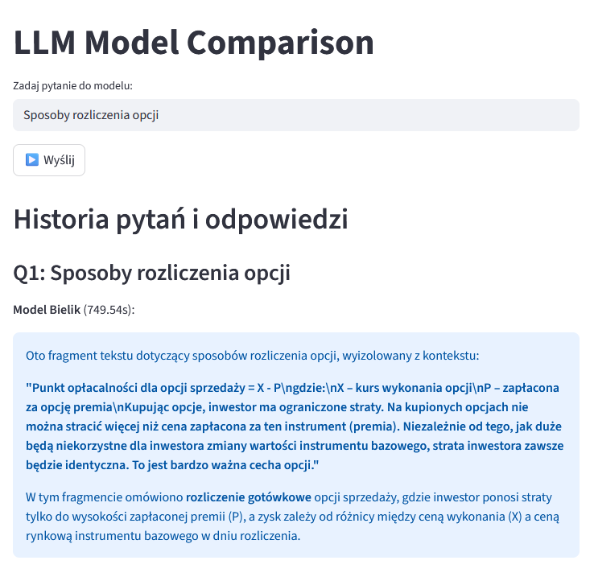
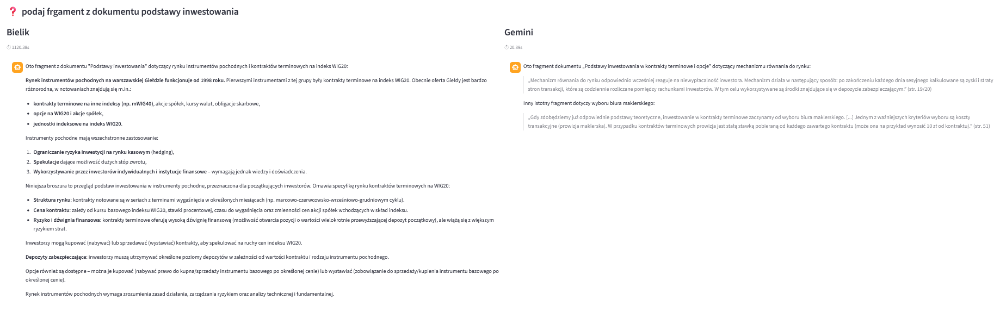

# Projekt z modelem Bielik

Projekt korzysta z lokalnego modelu językowego **Bielik 4.5B** uruchamianego przez Ollama.

---

## 📋 Wymagania wstępne

Przed uruchomieniem projektu upewnij się, że masz zainstalowane:

* **Python 3.10+**
* **pip**

### Instalacja Ollama

Pobierz i zainstaluj Ollama ze strony:
👉 [https://ollama.com/](https://ollama.com/)

Sprawdź, czy działa:

```bash
ollama --version
```

---

## 📚 Instalacja zależności Pythona

Projekt zawiera plik `requirements.txt` z wymaganymi bibliotekami.

Zainstaluj je poleceniem:

```bash
pip install -r requirements.txt
```

---

## 🔑 Konfiguracja klucza API

Aby aplikacja działała poprawnie, wymagany jest klucz API.

### Uzyskanie klucza API
Klucz API możesz wygenerować pod tym adresem:  
[https://aistudio.google.com/app/api-keys](https://aistudio.google.com/app/api-keys)

Zaloguj się na konto Google i utwórz nowy klucz API.

### Dodanie klucza do pliku `.env`
W głównym katalogu projektu utwórz plik `.env` (jeśli jeszcze nie istnieje), a następnie dodaj do niego klucz w poniższej formie:

```env
API_KEY="..."
```
---

## 🤖 Pobranie i dodanie modelu Bielik

Projekt korzysta z modelu **Bielik 4.5B**, który trzeba pobrać ze strony **Hugging Face**:

👉 [Bielik 4.5B na Hugging Face](https://huggingface.co/speakleash/Bielik-4.5B-v3.0-Instruct-GGUF)

### Pobierz model:

```bash
ollama pull hf.co/speakleash/Bielik-4.5B-v3.0-Instruct-GGUF:Q8_0
```

> ⚠️ Model jest duży (kilka GB), więc pobieranie może chwilę potrwać.

### Sprawdzenie modelu:

```bash
ollama list
```

### Dodanie modelu do projektu

W kodzie Python wystarczy podać ścieżkę/nazwę modelu w inicjalizacji:

```python
from langchain_ollama import ChatOllama

bielik_model = ChatOllama(
    model="hf.co/speakleash/Bielik-4.5B-v3.0-Instruct-GGUF:Q8_0",
    temperature=0.1
)
```

---

## ▶️ Uruchomienie projektu

Po wykonaniu powyższych kroków, uruchom projekt przez **Streamlit**:

```bash
streamlit run agent.py
```

Otworzy się interfejs webowy, przez który można korzystać z modelu Bielik.

---

## ⏱️ Uwaga dotycząca wydajności

- **Tworzenie embeddingu z PDF-a**: proces ten może zająć **około 12 minut**, w zależności od rozmiaru dokumentu.  
  Dopiero po zakończeniu tego kroku możliwe jest zadawanie pytań do dokumentu.

- **Odpowiedzi modelu**: generowanie odpowiedzi przez model może potrwać **do 14 minut**, szczególnie w przypadku bardziej złożonych pytań lub dużych dokumentów.

Prosimy o cierpliwość – procesy te wymagają sporej ilości zasobów i czasu.

---

## ✅ Podsumowanie kroków

1. Zainstaluj Python i pip
2. Zainstaluj Ollama
3. Zainstaluj zależności (`pip install -r requirements.txt`)
4. Pobierz model Bielik z Hugging Face i załaduj go w Ollama
5. Uruchom projekt: `streamlit run agent.py`

Po tym projekt powinien działać poprawnie z mod


## 🖼️ Przykład działania



